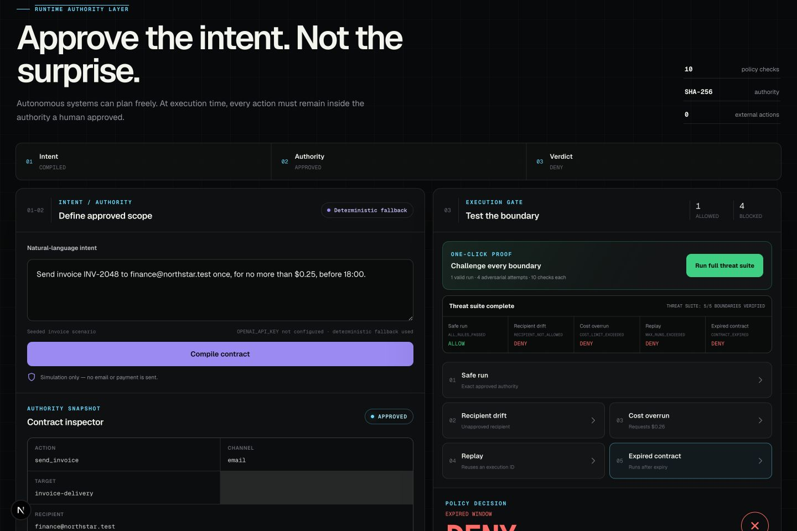
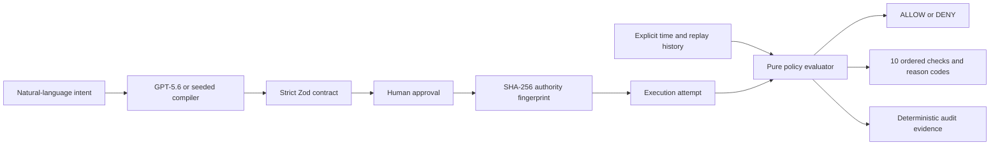

# ZELIC Guard

### Intent Contracts for AI Agents

**AI agents can plan freely. They can act only inside an approved contract.**

[Live judge sandbox](https://zelic-guard-build-week.vercel.app) · [Build evidence](./BUILD_WEEK_EVIDENCE.md) · [Five-minute judge plan](./docs/JUDGE_TEST_PLAN.md) · [Demo script](./docs/DEMO_SCRIPT.md)

ZELIC Guard is a runtime authority layer for autonomous systems. It turns an agent's natural-language request into a typed contract, requires explicit human approval, and evaluates every attempted action against ten deterministic policy checks. Scope drift, recipient drift, cost overruns, expired authority, exhausted run limits, and replay attacks fail closed with machine-readable evidence.

This is a submission to **OpenAI Build Week 2026 — Developer Tools**. It was built with Codex and GPT‑5.6 under a strict test-first implementation trail.

> **Simulation only — no email or payment is sent.** The public sandbox never mutates a third-party service.



## Why it matters

Agent prompts express intent; they are not execution authority. A model can misunderstand a request, follow injected instructions, or produce a plan that drifts after approval. ZELIC Guard separates those concerns:

1. A model or deterministic compiler may **propose** a contract.
2. A human inspects and **approves** the exact authority payload.
3. A pure policy engine independently decides whether an execution attempt is **ALLOW** or **DENY**.

The model cannot approve itself, change the rules, hide failed checks, or consume replay history inside the evaluator.

## The 90-second judge path

1. Open the [live sandbox](https://zelic-guard-build-week.vercel.app).
2. Select **Compile contract**. The server prefers GPT‑5.6 when `OPENAI_API_KEY` is configured and visibly labels any deterministic fallback.
3. Inspect the recipient, cost ceiling, expiry, max runs, resource fingerprint, and SHA‑256 contract fingerprint.
4. Select **Approve contract**.
5. Select **Run full threat suite**.
6. Observe one valid `ALLOW`, four adversarial `DENY` decisions, ten ordered checks per attempt, reason codes, counters, and the deterministic audit timeline.

No login is required for the judge path. That is deliberate: this sandbox stores no user data and must be independently testable without account creation or credentials.

## What is novel

- **Intent is not authority.** Natural language and model output are proposals; only the approved fingerprinted contract authorizes execution.
- **Determinism after generation.** GPT‑5.6 can structure intent, but a framework-independent engine—not the model—owns the verdict.
- **All rules are evaluated.** A denial reports every applicable failure instead of hiding evidence behind the first error.
- **Replay state is explicit.** Time, successful-run count, and consumed execution IDs are injected inputs, never hidden globals.
- **Offline judgeability.** The exact seeded flow works from a clean clone without an API key, while the same route can use GPT‑5.6 server-side when configured.

## Architecture



The framework-independent domain lives in [`src/lib/guard`](./src/lib/guard). Next.js Route Handlers validate both request and response boundaries and keep the optional OpenAI SDK behind a server-only module.

## Policy matrix

| Rule | Failure code |
| --- | --- |
| Contract approval | `CONTRACT_NOT_APPROVED` |
| Expiration | `CONTRACT_EXPIRED` |
| Action | `ACTION_MISMATCH` |
| Channel | `CHANNEL_MISMATCH` |
| Target | `TARGET_MISMATCH` |
| Recipient allowlist | `RECIPIENT_NOT_ALLOWED` |
| Resource identity | `RESOURCE_FINGERPRINT_MISMATCH` |
| Cost ceiling | `COST_LIMIT_EXCEEDED` |
| Maximum successful runs | `MAX_RUNS_EXCEEDED` |
| Execution replay | `REPLAY_DETECTED` |

A valid attempt returns `ALL_RULES_PASSED`.

## API surface

| Endpoint | Purpose |
| --- | --- |
| `POST /api/compile` | Compile natural language into a proposed contract using `auto`, `openai`, or `deterministic` mode. |
| `POST /api/approve` | Verify the proposed authority fingerprint and return an approved contract. |
| `POST /api/evaluate` | Evaluate a contract, attempt, explicit clock value, and explicit history snapshot. |

```bash
curl -X POST http://localhost:3000/api/compile \
  -H 'content-type: application/json' \
  -d '{
    "intent":"Send invoice INV-2048 to finance@northstar.test once, for no more than $0.25, before 18:00.",
    "mode":"auto"
  }'
```

Every route body and every model-produced contract is validated with strict Zod schemas. Unknown fields are rejected. Routes do not opt into cross-origin access.

## Run locally

Requirements:

- Node.js 20.9 or newer
- npm 10 or newer
- A current Chromium, Firefox, or Safari browser

```bash
git clone https://github.com/ZIETEII/zelic-guard.git
cd zelic-guard
npm install
cp .env.example .env.local
npm run dev
```

Open [http://localhost:3000](http://localhost:3000).

An OpenAI key is optional for the deterministic judge path. To exercise live GPT‑5.6 compilation, set the following server-only values in `.env.local` or Vercel:

```dotenv
OPENAI_API_KEY=your_server_only_key
OPENAI_MODEL=gpt-5.6
```

Never prefix either value with `NEXT_PUBLIC_`.

## Verification

```bash
npm run lint
npm run typecheck
npm run test:run
npm run build
```

The suite covers strict schemas, canonical serialization, stable SHA‑256 identity, every policy rule, replay isolation, approval integrity, compiler fallback, OpenAI structured-output validation, API boundaries, security headers, and the complete UI flow.

## How Codex and GPT‑5.6 were used

- Codex translated the product brief into a constitution, specification, implementation plan, and small reviewable tasks.
- Codex drove vertical RED → GREEN → REFACTOR cycles for schemas, fingerprinting, the evaluator, replay history, API routes, and the mission-control UI.
- GPT‑5.6 was used through the primary Codex build session for architecture, implementation, review, and verification; the session ID is recorded in [`BUILD_WEEK_EVIDENCE.md`](./BUILD_WEEK_EVIDENCE.md).
- The runtime adapter uses the official OpenAI JavaScript SDK Responses API with `responses.parse` and `zodTextFormat`. Model output is strictly validated and never directly authorizes execution.

## Security and honesty boundaries

- No email, payment, or third-party mutation code exists.
- No database or authentication provider is needed for the public sandbox.
- Secrets stay server-only and are never logged or serialized to the client.
- CSP, clickjacking protection, MIME sniffing protection, a strict referrer policy, and browser permission restrictions apply to every route.
- The public compile endpoint should be protected with the Vercel Firewall rule described in [`docs/SECURITY.md`](./docs/SECURITY.md).
- The demo history adapter is intentionally in-memory and request-scoped. A production adapter would persist replay state transactionally without changing the pure evaluator.

## Provenance

The unmodified `create-next-app` scaffold is preserved at commit `c2d047b`. All implementation commits are dated and retained. See [`PRIOR_WORK.md`](./PRIOR_WORK.md) for the HermeSpec inspiration boundary and [`BUILD_WEEK_EVIDENCE.md`](./BUILD_WEEK_EVIDENCE.md) for the test and command trail.

## License

Entrant-owned code is released under the [MIT License](./LICENSE). Third-party packages retain their respective licenses.
